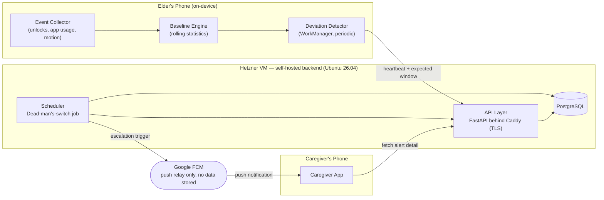
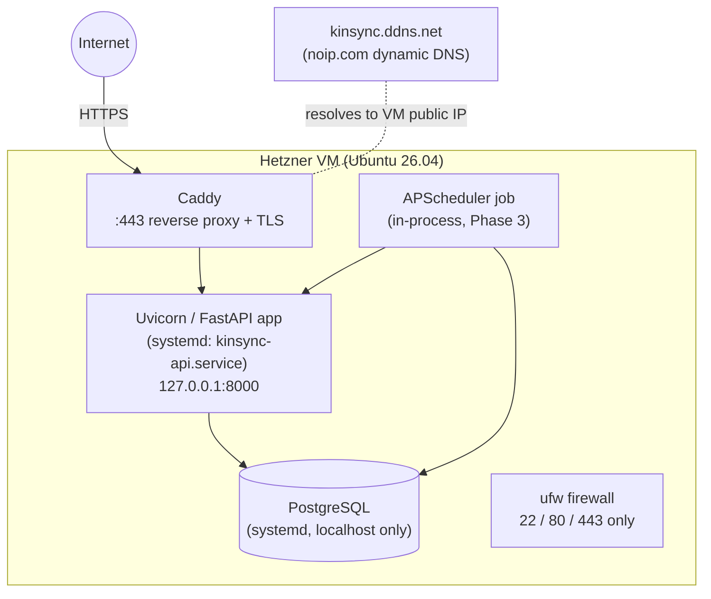

# KinSync — System Architecture

**Version:** 0.1 (content as presented at Review 2; reorganized 2026-10-04)
**Requirements:** [../specs/requirements.md](../specs/requirements.md)
· **Related:** [tech-stack.md](tech-stack.md) · [data-model.md](data-model.md) ·
[api-contract.md](api-contract.md) · [flows.md](flows.md) · [security-privacy.md](security-privacy.md)
· [decisions/](decisions/)

---

## 1. Guiding Principles

1. **Privacy by construction, not by policy.** Raw activity data (unlock times, app names,
   motion) never leaves the elder's device. Only derived, minimal signals (a heartbeat and an
   expected check-in window) are transmitted.
2. **Dead-man's switch, not self-reporting.** The backend — not the elder's phone — owns the
   decision of when to escalate, because the phone itself may be the thing that's failed (dead
   battery, no signal, an unresponsive user).
3. **Ask before alarming.** The elder always gets a chance to say "I'm fine" before family is
   notified.
4. **Own the stack to learn the stack.** The backend is deliberately self-hosted on a Hetzner VM
   rather than built on a managed BaaS, so the team gains real experience with API design,
   databases, scheduling, and Linux server administration
   ([ADR-0001](decisions/0001-self-hosted-backend.md)).

## 2. System Context

**Why this shape:** the elder's phone does all the "understanding" of what's normal for that
person (privacy-sensitive work stays local). The backend only ever sees a thin, derived summary,
but is still able to independently decide "this elder has gone quiet" because it tracks
*expected* windows, not raw behavior. FCM is used purely as Google's mechanism for waking a
sleeping Android device — no alert content or user data is ever stored by Google.

## 3. Repositories

| Repo | Contents | Repo-local docs |
|---|---|---|
| [kinsync-api](https://github.com/nithinvin/kinsync-api) | FastAPI backend, deploy configs (`deploy/`) | `README.md`, `docs/development.md`, `docs/design.md` |
| [kinsync-android](https://github.com/nithinvin/kinsync-android) | Kotlin Android app (Elder + Caregiver modes) | `README.md`, `docs/setup.md`, `docs/design.md`, `docs/build-and-install.md` |
| [kinsync-docs](https://github.com/nithinvin/kinsync-docs) | This repo: specs, design, plan, runbooks, IDP material | — |

The **contract between the two code repos** is [api-contract.md](api-contract.md). Any change to
an endpoint is made there first, then implemented in both repos.

## 4. Components & Modules

Each module is tagged with the phase it's first introduced in (see
[../plan/roadmap.md](../plan/roadmap.md)). Status of each lives in
[../specs/traceability.md](../specs/traceability.md).

### 4.1 Android App

| Module | Responsibility | Phase |
|---|---|---|
| **Onboarding & Consent UI** | Role selection (Elder/Caregiver), plain-language consent screen, permission rationale | Phase 1 (basic) → refined Phase 4 |
| **Event Collector** | `BroadcastReceiver` for unlock/screen events, `UsageStatsManager` queries, last-moved (significant motion), Activity Recognition, charging + call events | Phase 1 (unlock events) → Phase 2 (usage, motion, activity, charging, calls) |
| **Local Storage** | Room database for raw events, on-device only | Phase 1 |
| **Baseline Engine** | Rolling statistics over the local event log | Phase 3 |
| **Deviation Detector** | Periodic `WorkManager` job comparing today vs. baseline; in-app nudge | Phase 3 |
| **Heartbeat Sync Client** | Sends derived heartbeat + expected window to backend | Phase 3 |
| **Pairing UI** | Generate/redeem pairing codes | Phase 3 |
| **Activity Views** | "My day" timeline + daily summary of collected signals (on-device only) | Phase 2 |
| **Caregiver Dashboard UI** | Status view, activity trend, acknowledge/resolve alerts | Phase 4 |

Current package layout: see kinsync-android
[`docs/design.md`](https://github.com/nithinvin/kinsync-android/blob/main/docs/design.md).

### 4.2 Backend (Hetzner VM)

| Module | Responsibility | Phase |
|---|---|---|
| **API Layer** | FastAPI routers behind Caddy; starts as a bare health-check | Phase 1 (health check) → grows each phase |
| **Data Layer** | SQLAlchemy models + Alembic migrations against PostgreSQL | Phase 1 (connectivity only) → Phase 3 (real schema) |
| **Auth** | Device-bound bearer token issuance/validation | Phase 3 |
| **Pairing Service** | Pairing-code generation/redemption logic | Phase 3 |
| **Scheduler (dead-man's switch)** | Periodic job checking every elder's heartbeat against their expected window | Phase 3 |
| **Notification Service** | FCM Admin SDK wrapper, sends escalation pushes | Phase 3 |
| **Ops/Deployment** | systemd units, Caddy config, firewall, backups | Phase 1 (minimal) → hardened through later phases |

Current module layout: see kinsync-api
[`docs/design.md`](https://github.com/nithinvin/kinsync-api/blob/main/docs/design.md).

## 5. Deployment View

Operating procedures: [../runbooks/](../runbooks/).
