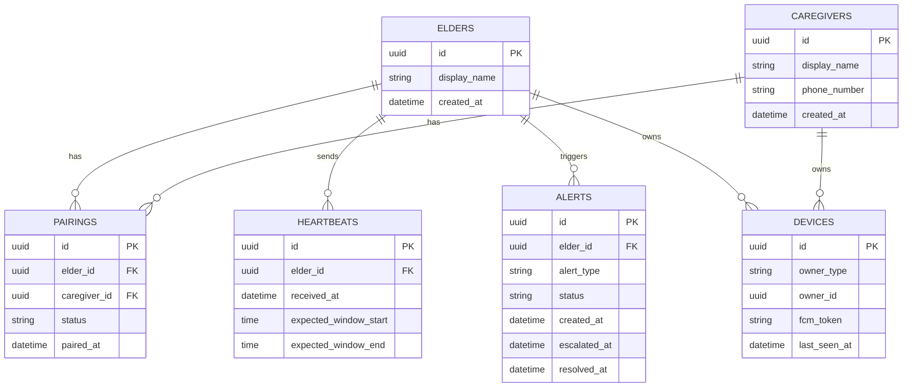

# KinSync — Data Model

**Version:** 0.1 (target schema; reorganized 2026-10-04)

## 1. Backend (PostgreSQL) — target schema

Phase-1 has **no tables yet** (connectivity only). This schema goes live in Phase-3 via Alembic
migrations.

Note the deliberate omission of any raw-activity table on the backend — this is the
schema-level enforcement of the privacy principle (NFR-1, FR-7.2).

## 2. Android (Room, on-device only)

| Entity (table) | Fields | Since | DB version |
|---|---|---|---|
| `UnlockEvent` (`unlock_events`) | `eventType` (`UnlockEventType`), `timestampEpochMillis` | Phase-1 | 1 |
| `AppUsageInterval` (`app_usage_intervals`) | `packageName`, `startEpochMillis`, `endEpochMillis`; unique on (`packageName`, `startEpochMillis`) | Phase-2 M2 | 2 |
| `MovementEvent` (`movement_events`) | `timestampEpochMillis` (significant-motion trigger; time only) | Phase-2 M3 | 3 |
| `ActivityTransitionRecord` (`activity_transitions`) | `activity` (`STILL` / `WALKING` / `IN_VEHICLE`), `kind` (`ENTER` / `EXIT`), `timestampEpochMillis`; unique on (`activity`, `kind`, `timestampEpochMillis`) | Phase-2 M4 | 4 |

Each version step is a real migration that keeps earlier data (kinsync-android
`data/Migrations.kt`); exported schemas live in kinsync-android `app/schemas/`. The summary
(M5) and the timeline (M6) only read these tables, so version 4 is the Phase-2 schema.

Planned for Phase-3 (Nice, moved from Phase-2 on 2026-10-09): charging and
call events (times/counts only) — all on-device only; app names never leave the phone (NFR-1).
Exact entities are recorded here when implemented.
