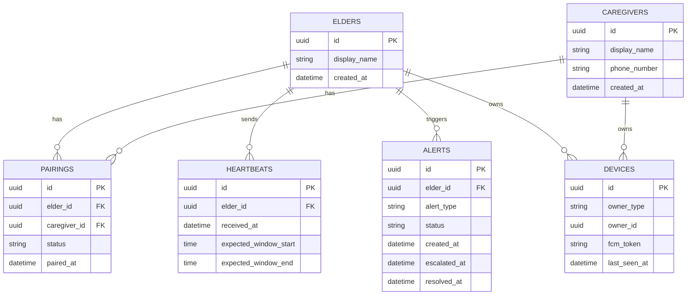

# KinSync — Data Model

**Version:** 0.1 (target schema; reorganized 2026-10-04)

## 1. Backend (PostgreSQL) — target schema

Phase-1 has **no tables yet** (connectivity only). This schema goes live in Phase-2 via Alembic
migrations.

Note the deliberate omission of any raw-activity table on the backend — this is the
schema-level enforcement of the privacy principle (NFR-1, FR-7.2).

## 2. Android (Room, on-device only)

| Entity | Fields | Since |
|---|---|---|
| `UnlockEvent` | `eventType` (`UnlockEventType`), `timestampEpochMillis` | Phase-1 |

Nothing else — no app names, no location, no content. Usage-window and motion entities arrive in
Phase-2.
