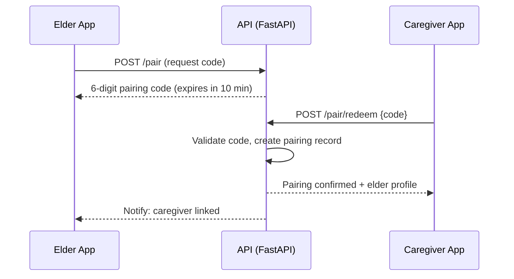
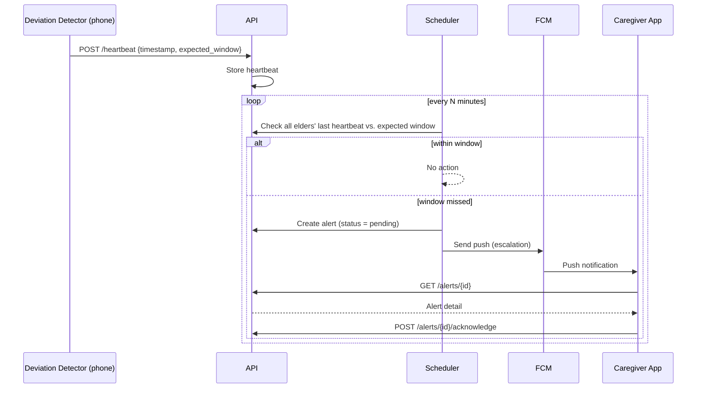
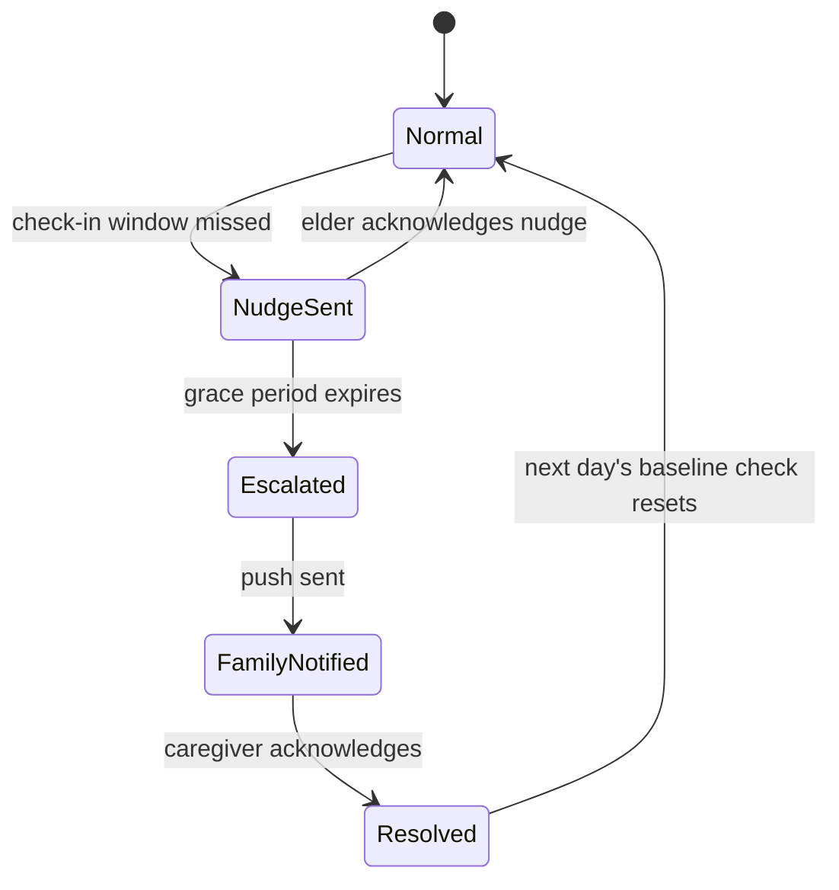

# KinSync — Key Flows

**Version:** 0.1 (content as presented at Review 2; reorganized 2026-10-04)

## 1. Pairing (FR-1, Phase-3)

## 2. Heartbeat & Dead-Man's-Switch Escalation (FR-4, Phase-3)

## 3. Alert Lifecycle

## 4. Android onboarding (implemented, Phase-1)

Consent → usage-access rationale (Settings deep-link) → battery-optimization allowlist
(+ `POST_NOTIFICATIONS` on API 33+) → debug/home screen. Each permission screen re-checks its
permission on `ON_RESUME`. Details: kinsync-android
[`docs/design.md`](https://github.com/nithinvin/kinsync-android/blob/main/docs/design.md).
